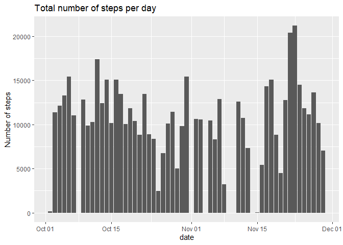
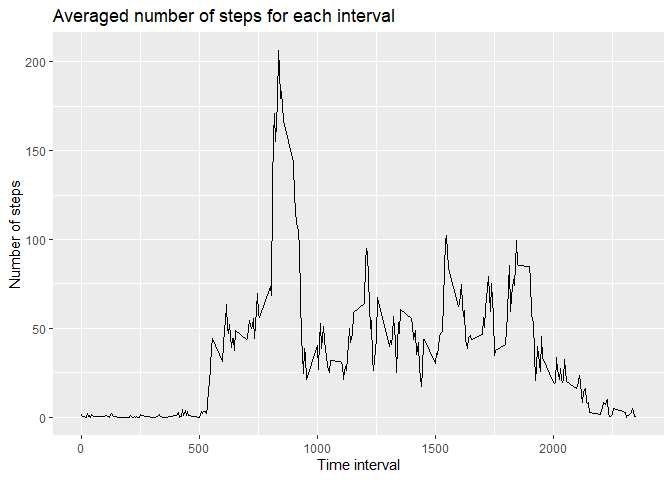
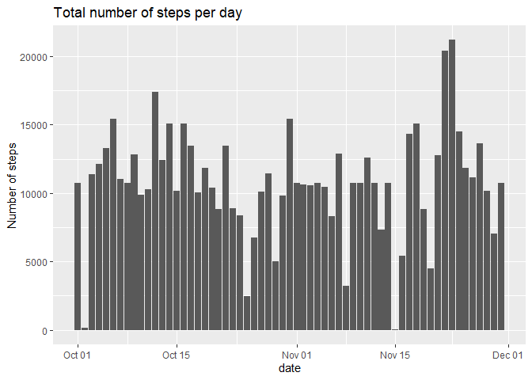
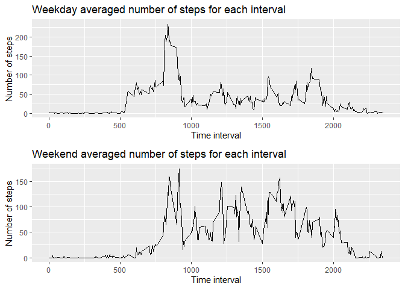

## Loading and preprocessing the data saving dates as date a date object
Removing NA's, and transforming the dates to a date object.

```r
data<-read.csv('activity.csv')
data<-subset(data,!(is.na(data$steps)))
data$date<-as.character(data$date)
data$date<-as.Date(data$date,'%Y-%m-%d')
```


## What is mean total number of steps taken per day?
Finding and plotting the number of steps per day.

```r
data2<-aggregate(data$steps,by=list(date=data$date),FUN=sum,na.rm=T)
g<-ggplot(data=data2,aes(x=date,y=x))
g+geom_bar(stat = 'identity')+labs(x='date',y='Number of steps',title='Total number of steps per day')
```

<!-- -->

The mean for the total steps per day is 1.0766189\times 10^{4} and the median is 10765  


## What is the average daily activity pattern?
Finding and plotting the average number of steps per interval.

```r
data3<-aggregate(data$steps,by=list(interval=data$interval),FUN=mean)
p<-ggplot(data=data3,aes(x=interval,y=x))
p+geom_line()+labs(x='Time interval',y='Number of steps',title='Averaged number of steps for each interval')
```

<!-- -->

the interval that registered the highest number of steps taken on average is interval 835  

## Imputing missing values
calculating the total number of NA's

```r
data4<-aggregate(data$steps,by=list(date=data$date),FUN=mean,na.rm=T)
data1<-read.csv('activity.csv')
sum(is.na(data1$steps))
```

```
## [1] 2304
```
Replacing NA values for the mean of that given interval

```r
data1$date<-as.character(data1$date)
data1$date<-as.Date(data1$date,'%Y-%m-%d')
newsteps<-vector(mode='numeric')
for(i in seq(length(data1$steps))){
  if(is.na(data1$steps[i])){
    interval<-data1$interval[i]
    newsteps[i]<-data3$x[interval==data3$interval]
  } else{
    newsteps[i]<-data1$steps[i]
  }
}
data1$steps<-newsteps
```
Plotting the total number of steps each day

```r
data21<-aggregate(data1$steps,by=list(date=data1$date),FUN=sum,na.rm=T)
g<-ggplot(data=data21,aes(x=date,y=x))
g+geom_bar(stat = 'identity')+labs(x='date',y='Number of steps',title='Total number of steps per day')
```

<!-- -->

The mean for the total steps per day is 1.0766189\times 10^{4} and the median is 1.0766189\times 10^{4}. As we can see, while the mean stayed the same, the median had a sligth decrease.  

## Are there differences in activity patterns between weekdays and weekends?  

Creating a factor variable to separate the data between weekdays and weekends

```r
weekday<-c("Monday","Tuesday","Wednesday","Thursday","Friday")
weekend<-c('Saturday','Sunday')
daytype<-vector(mode='character')
for(i in seq(length(data$date))){
  if(weekdays(data$date[i]) %in% weekday){
    daytype[i]<-'weekday'
  } else if(weekdays(data$date[i]) %in% weekend){
    daytype[i]<-'weekend'
  }
}
data$daytype<-as.factor(daytype)
datas<-split(data,daytype)
dataweek<-aggregate(datas[[1]]$steps,by=list(interval=datas[[1]]$interval),FUN=mean)
dataend<-aggregate(datas[[2]]$steps,by=list(interval=datas[[2]]$interval),FUN=mean)
```

And now plotting to see the difference on the total steps for each interval in weekdays vs weekends

```r
p2<-ggplot(data=dataweek,aes(x=interval,y=x))+geom_line()
p2<-p2+labs(x='Time interval',y='Number of steps',title='Weekday averaged number of steps for each interval')
p3<-ggplot(data=dataend,aes(x=interval,y=x))+geom_line()
p3<-p3+labs(x='Time interval',y='Number of steps',title='Weekend averaged number of steps for each interval')
grid.arrange(p2,p3,ncol=1)
```

<!-- -->
